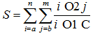

# Object-Oriented Programming Labs (2019)

<h3 align="center">Lab 1</h3> 
<b>Task:</b> 

Create a class that consists of an executable method that calculates the value of a function 

    

 
with the specified index type, operations, and constant. The result of the action is the only value of the valid type. It is necessary to process all exceptional situations that may arise during the execution of program code. All variables must be described and their values specified in the execution method. &nbsp;&nbsp;

&nbsp;&nbsp;&nbsp;&nbsp;**Type of indices i and j**: `int`

&nbsp;&nbsp;&nbsp;&nbsp;**Operations**: `-`, `%`

&nbsp;&nbsp;&nbsp;&nbsp;**Constant value**: `1`

<h3 align="center">Lab 2</h3> 
<b>Task:</b> 

Create a class that consists of an executable method that performs an action with a matrix with the specified type of elements and an action with the resulting matrix C. Display the results of the first and second actions. It is necessary to process all exceptional situations that may arise during the execution of program code. All variables must be described and their values specified in the execution method. &nbsp;&nbsp;

&nbsp;&nbsp;&nbsp;&nbsp;**Action performed with the matrix**: `C=A+B`

&nbsp;&nbsp;&nbsp;&nbsp;**Type of matrix elements**: `short`

&nbsp;&nbsp;&nbsp;&nbsp;**Action with the matrix C**: `Find the average value of the elements of the matrix`

<h3 align="center">Lab 3</h3> 
<b>Task:</b> 

Create a class consisting of an executable method that performs an action with a text string, the type of which is defined by specified option. It is necessary to process all exceptional situations that may arise during the execution of program code. All variables must be described and their values specified in the execution method. &nbsp;&nbsp;

&nbsp;&nbsp;&nbsp;&nbsp;**Type of text variables**: `StringBuffer`

&nbsp;&nbsp;&nbsp;&nbsp;**Action with a string**: `In each word of a given text, delete all previous occurrences of the last letter of that word`

<h3 align="center">Lab 4</h3> 
<b>Task:</b> 

Create a class with an executable method in which to create an array of objects of the class of the specified variant. Sort the array, by one of the fields, in ascending order, and the other, in descending order, using standard sorting tools. All variables must be described and their values specified in the execution method. &nbsp;&nbsp;

&nbsp;&nbsp;&nbsp;&nbsp;**Action**: `Identify a student class that consists of at least 5 fields`

<h3 align="center">Lab 5</h3> 
<b>Task:</b> 

Create a class consisting of an executable method that performs an action with a text string, the type of which is defined by specified option. It is necessary to process all exceptional situations that may arise during the execution of program code. All variables must be described and their values specified in the execution method. &nbsp;&nbsp;

1. Modify the laboratory work #3 as follows: create separate classes for letters, words, sentences, punctuation and text. A word should consist of an array of letters, a sentence of an array of words and punctuation, a text of an array of sentences. Replace the sequence of tabs and spaces with one space.

2. Create a class that consists of an executive method that performs the described action from laboratory work #3, but uses the created classes as types. It is necessary to process all exceptional situations that may arise during the execution of program code. All variables must be described and their values specified in the execution method.

<h3 align="center">Lab 6</h3> 
<b>Task:</b> 

Create a generalized class and at least 3 descendant classes that describe the given area of knowledge. Create a class consisting of an array of objects with which you can perform the specified actions. It is necessary to process all exceptional situations that may arise during the execution of program code. All variables must be described and their values specified in the execution method.

&nbsp;&nbsp;&nbsp;&nbsp;**Action**: `Load a van of a certain volume with a certain amount of different types of coffee that may be in different physical states (grain, ground, soluble in jars and bags). Take into account the amount of coffee together with the package. To sort goods on the basis of a ratio of the price and weight. Find the product in the van that corresponds to the specified range of coffee quality`

<h3 align="center">Lab 7</h3> 
<b>Task:</b> 

Create a class that describes a typed collection (collection type is a generalized class from laboratory work #6), which implements the specified interface and has a specified internal structure. Implement all interface methods, as well as create at least 3 constructors (1 - empty, 2 - in which 1 object of the generalized class is transferred, 3 - in which the standard collection of objects is transferred). All initial data are set in the executive method.

&nbsp;&nbsp;&nbsp;&nbsp;**Interface that the collection implements**: `Set`

&nbsp;&nbsp;&nbsp;&nbsp;**Internal structure of the collection**: `Array with an initial number of elements of 15 and an increase in the number of elements by 30%`

